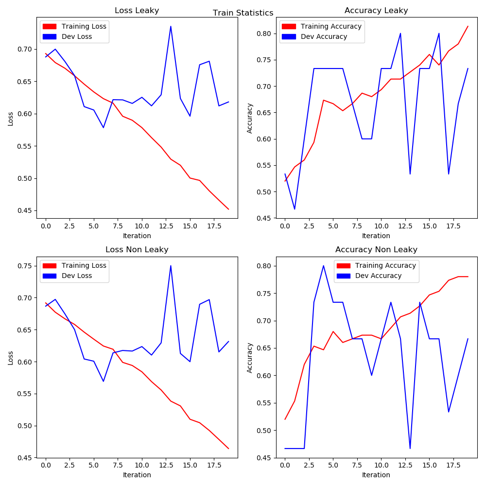

# Image
This repository contains my approach for making an apple detector using tensorflow. 
The code is made for internship shortlisting project and required to have atleast 100 images.

## Requiremenets of Project
You are building TWO models using Tensorflow to recognize apple fruit in images. 

1. You will NOT use pretrained models. You will do the training yourself. Create a training data set of atleast 100 images. Also create a validation data set of 10 images. Make sure the training dataset has images of different sizes and apples of different colors.
2. Convert the training data image to a tfrecord.
3. Create your OWN activation function (using tensorflow lambdas) instead of the normal ones. Justify why you are choosing this - if you choose others and this worked better, tell us about all the ones that didnt work !
4. Create two CNN models - one using your own activation function and the other using Relu. Create the models by training them on the training dataset.
5. Compare which one was better using the validation dataset.

## Custom Activation Function
Since tensorflow doesn't have any leaky relu functionality in `nn` submdoule. I decided to go with it. 
As can be seen in `model.py` at `line 51` my implementation of leaky relu using lambdas was as follows.</ br>
```relu = lambda x: tf.nn.relu(x) - alpha * tf.nn.relu(-x)```

One benefit of using Relu (Non-leaky) is that it gives you a non-diminishing gradient in positive half.
But this benefit drops down when we come in the region of negative part, as the gradient there equals to 0.
Leaky-Relu, overcomes this by giving us a small positive gradient in the negative region.


## Comparison
Since the dataset was too small. I decided to go with Stochastic Gradient Descent.
Looking at the graph, we can make some comparisons of the 2 models.

1. Final Validation accuracy of leaky relu was almost around 73% while that of simple relu was about 66%. This might prove at first sight that leaky relu is better. But since the dataset size is small we cannot guarantee about it.
2. The Training Loss in both cases went down almost identically.
3. The Validation Loss in both the cases was identical. Remember that even though we had to calculate relu in case of Leaky-Relu we didn't really get any advantage over simple relu.
4. Leaky-Relu removed certain peaks in validation accuracy.

## Results


## Directory Structure
```
Project
|-- datasets
|   |-- test
|	|	|-- apples
|	|	|-- others
|	|	`-- test.tfrecord
|   |-- train
|	|	|-- apples
|	|	|-- others
|	|	`-- train.tfrecord
|   |-- validation
|	|	|-- apples
|	|	|-- others
|	|	`-- dev.tfrecord
|-- models
|	|-- leaky_model
|	`-- non_leaky_model
|-- images
|-- datalab.py
|-- main.py
|-- model.py
|-- util.py
`-- visualize.py
```
